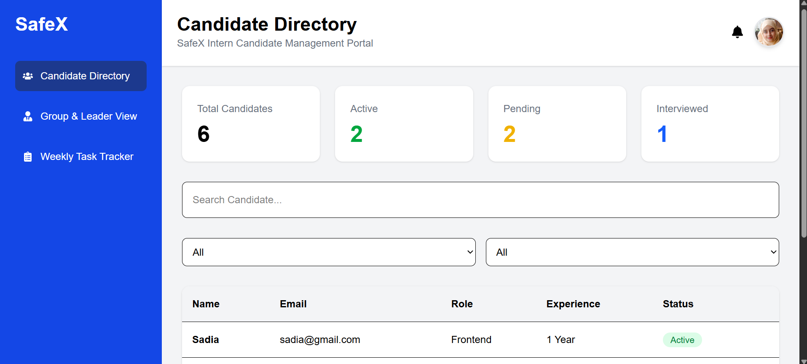
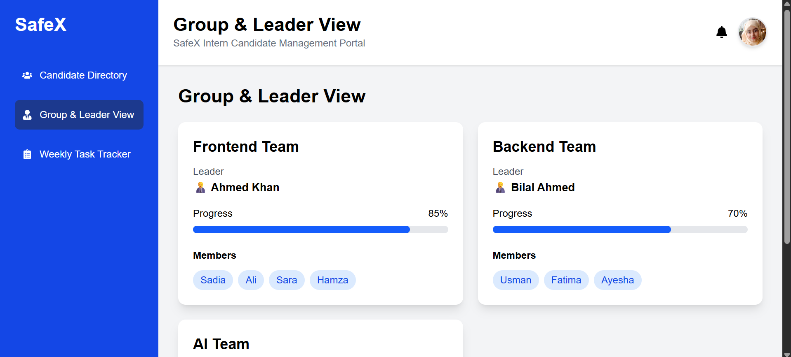
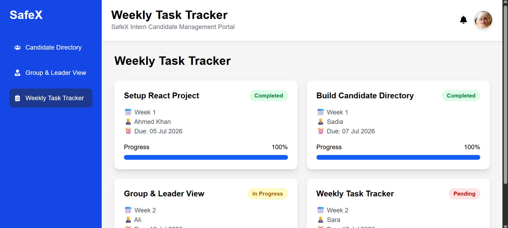

# 🚀 SafeX Intern Candidate Management Portal

A modern and responsive **Intern Candidate Management Portal** built with **React.js** and **Tailwind CSS** as part of my Frontend Development Internship at **SafeX Solutions**.

This project demonstrates the implementation of multiple dashboard modules commonly used in recruitment and internship management systems.

---

## 📸 Preview








Example:

- Candidate Directory
- Group & Leader View
- Weekly Task Tracker

---

## ✨ Features

### 👥 Candidate Directory

- View all candidates
- Search candidates by name
- Filter by Role
- Filter by Status
- Statistics Cards
- Responsive Table Layout

---

### 👨‍💼 Group & Leader View

- Display internship groups
- Team Leader Information
- Team Members
- Progress Tracking
- Modern Card Layout

---

### 📋 Weekly Task Tracker

- Weekly assigned tasks
- Task Status
- Due Dates
- Assigned Leader
- Progress Bar
- Completion Tracking

---

## 🛠️ Tech Stack

- React.js
- React Router DOM
- Tailwind CSS
- JavaScript (ES6+)
- Vite
- React Icons

---

## 📂 Project Structure

```
candidate-directory/
│
├── public/
│
├── src/
│   ├── assets/
│   ├── components/
│   ├── data/
│   ├── pages/
│   ├── App.jsx
│   ├── main.jsx
│   └── index.css
│
├── package.json
└── vite.config.js
```

---

## 📌 Modules

### Dashboard

Displays the main overview of the portal.

### Candidate Directory

Manage and search intern candidates.

### Group & Leader View

Displays internship groups, team leaders, and members.

### Weekly Task Tracker

Monitor weekly assigned tasks and completion progress.

---

## 🚀 Installation

Clone the repository

```bash
git clone https://github.com/your-username/candidate-directory.git
```

Go into the project

```bash
cd candidate-directory
```

Install dependencies

```bash
npm install
```

Run the development server

```bash
npm run dev
```

---

## 📱 Responsive Design

The application is designed to work on:

- Desktop
- Laptop
- Tablet
- Mobile Devices

---

## 🎯 Learning Objectives

This project helped me practice:

- Component-Based Architecture
- React Hooks
- React Router
- State Management
- Reusable Components
- Responsive UI Design
- Dashboard Layout Design

---

## 👩‍💻 Developed By

**Sadia**

Software Engineering Student

Frontend Development Intern @ SafeX Solutions

---

## ⭐ If you like this project

Please consider giving it a ⭐ on GitHub.
